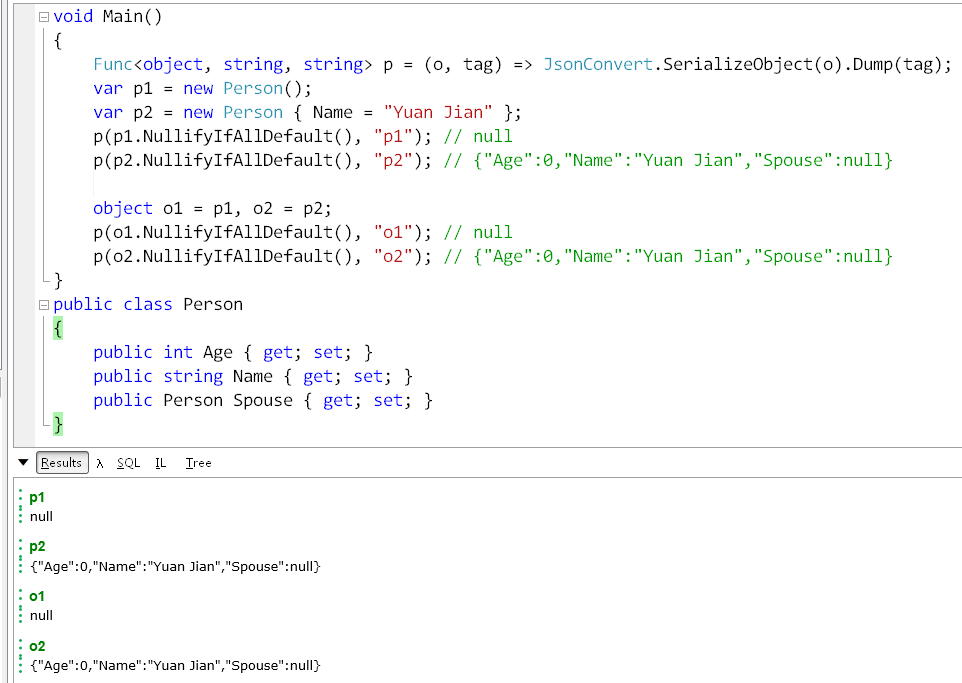

Not sure what your reaction will be if you receive an instance of a class from some method call where all properties/fields are default values like 0 or null, like the one below which i encountered today:

```json
{
    Applicant: null,
    ApplicantId: 0,
    AuditTime: null,
    AuthenticationId: 0,
    BackPhotoIdUrl: null,
    BrandName: null,
    Capital: null,
    CompanyFullName: null,
    CompanyId: 0,
    CompanyName: null,
    Corporation: null,
    CreatedTime: '0001-01-01T00:00:00+08:00',
    EstablishTime: null,
    IdCardNumber: null,
    LicenseNo: null,
    LicenseUrl: null,
    Mobile: null,
    Operator: null,
    PhotoIdUrl: null,
    Remark: null,
    Status: 0,
    StatusDisplayString: '未知', //this is the default value of an enum
 }
```

I developed this c# extension is to help mitigate a particular problem while using protobuf-net.Grpc. The detailed problem is described in this issue:	https://github.com/protobuf-net/protobuf-net.Grpc/issues/36. In a word, it is basically because prototobuf does not have a concept of null.

Originally, I have a set of services which are invoked directly. Recently we are migrating them into a RPC services using protobuf-net.Grpc. Originally we return null to indicate something really is not there but now we get empty non-null objects like the one above.

This util will help you convert a non-null objects with all public properties/fields equal to their default values back to null. Of course you have to explicity call the extension method, but it is much easier than checking all props/fields manually yourself.



```csharp
void Main()
{
	var p1 = new Person();
	var p2 = new Person { Name = "Yuan Jian" };
	var p3 = new Person { BirthYear = 1985 };
	p1.NullifyIfAllDefault().Dump("p1"); // null
	p2.NullifyIfAllDefault().Dump("p2"); // p2
	p3.NullifyIfAllDefault().Dump("p3"); // p3
}
public class Person
{
	public int Age { get; set; }
	public int BirthYear;
	public string Name { get; set; }
	public Person Spouse { get; set; }
}

```